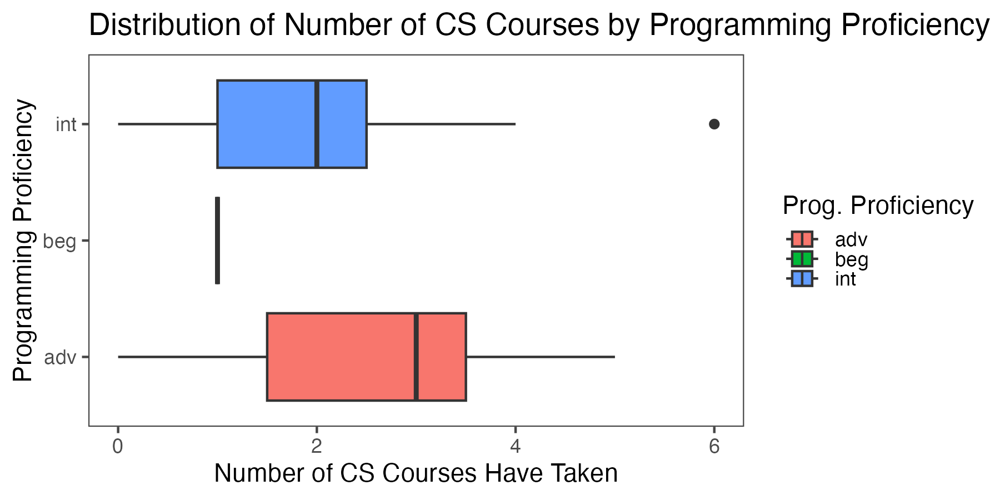
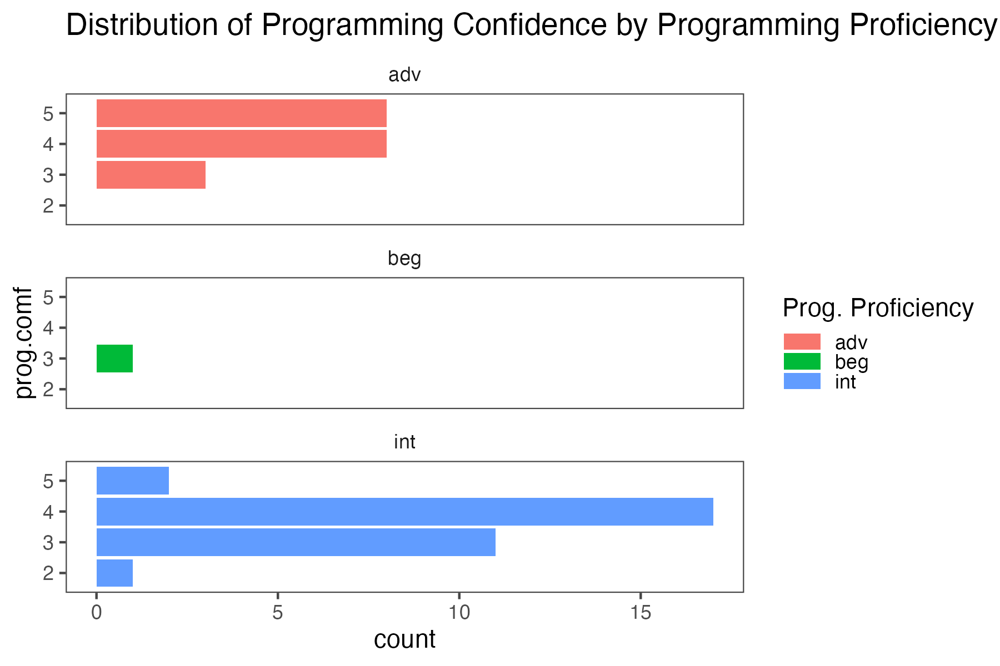
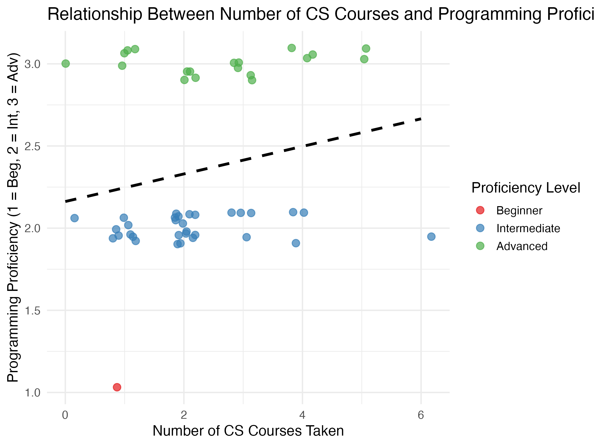

```{r setup, include=FALSE}
knitr::opts_chunk$set(echo = TRUE)
```
## Findings (Q2)

**Question.** 

How will the number of Computer Science courses that a student takes affects the students' programming proficiency? 

**Overview**
For this question, we investigate on whether the number of computer science (CS) courses a student has taken is associated with their self-reported programming proficiency level. The goal is to determine if greater exposure to CS coursework corresponds to higher programming skill levels, as measured by students’ proficiency categories (beginner, intermediate, advanced) in the survey dataset.

**Data and Methodology**
We derived the variable cs_total, representing the total number of CS courses each student completed, by summing binary indicators for each course. In addition to core CS courses (e.g., CS 9, CS 16, CS 130), we also included PSTAT 100, 131, and 134, since these courses require programming in R and involve data manipulation, which contributes to programming experience.
  Programming proficiency was encoded numerically (1 = Beginner, 2 = Intermediate, 3 = Advanced) to facilitate regression and visualization. We then ran a simple linear regression model to evaluate the relationship between cs_total and prof.
### Proficiency composition

**Description**
This boxplot displays the distribution of the total number of CS courses taken for each programming proficiency group (beginner, intermediate, advanced). The x-axis represents the number of CS courses taken, while the y-axis categorizes students by their self-reported proficiency.

**Interpretation:**
From the graph, we can observe that:

**Advanced students (red)** tend to have taken more CS courses on average than intermediate or beginner students. Their interquartile range is higher, and their median is around 2–3 courses.

**Intermediate students (blue)** show a slightly lower median but also a wider spread, ranging from 1 to 5 courses, with a few outliers who have taken 6 or more.

**Beginners (green)** have taken very few or no CS courses, with their distribution concentrated near 0–1.

Overall, this pattern **supports the hypothesis that taking more CS courses generally corresponds to higher programming proficiency.** However, the overlap between intermediate and advanced groups suggests that coursework alone does not fully determine skill level—experience outside formal classes might also influence proficiency.


**Description:**
This bar chart shows how students’ self-reported confidence levels (1–5 scale) vary across different proficiency groups. Each bar indicates the count of students who selected a given confidence rating.

**Interpretation:**
Students in the advanced group mostly report high confidence levels, typically 4 or 5, indicating consistency between their proficiency and self-assessment.

The intermediate group also shows a large cluster of high confidence scores (mostly 3–5), which suggests that many intermediate-level students also very comfortable with programming.

The beginner group is small, but its few members report lower confidence levels, typically 2–3, as expected.

**Overall Analysis:**
The visualization shows that programming confidence generally increases with proficiency, but the relationship is not perfectly linear.

  Advanced students show consistently high confidence, as expected.

  Intermediate students’ confidence overlaps considerably with the advanced group, indicating subjectivity in self-perceived skill levels.

The variation also highlights that confidence does not always correspond directly to technical ability—students’ previous experiences (e.g., PSTAT courses, self-study, or non-CS exposure) may also shape how confident they feel when coding.


**Description:**
This scatterplot displays the relationship between the number of CS courses taken (x-axis) and students’ self-reported programming proficiency (y-axis, coded as 1 = Beginner, 2 = Intermediate, 3 = Advanced).
Each dot represents one student, color-coded by proficiency group—red for beginners, blue for intermediates, and green for advanced. The black dashed line shows the fitted linear regression trend from the model: 
Proficiency=β0 + β1(Number of CS Courses) + ϵ

**Interpretation:**
The plot shows a positive upward trend, suggesting that students who have taken more CS courses tend to report higher programming proficiency levels.

1.Trendline:

The dashed regression line slopes upward, indicating a positive coefficient for cs_total.

This means that, on average, each additional CS course is associated with a higher proficiency score.

2.Group Distribution:

Advanced students (green) cluster toward the upper part of the plot (proficiency ≈ 3) and typically have taken multiple CS courses, ranging roughly from 2 to 6.

Intermediate students (blue) form the majority and are spread across the middle range of CS course counts (1–4). Their distribution is relatively flat, reflecting that many have moderate experience regardless of exact course count.

Beginners (red) are few and positioned near the lower left—indicating both low proficiency and minimal course exposure.

3.Overlap & Variability:

Although the general trend supports a positive relationship, there is overlap between intermediate and advanced levels.
For instance, some students with 3–4 CS courses still identify as intermediate, while a few advanced students have taken only 1–2.

This overlap suggests that while formal coursework contributes strongly to skill development, other learning pathways (e.g., self-study, statistics programming, or project experience) can also elevate proficiency.

**Conclusion:**
This visualization reinforces the finding that coursework exposure is positively associated with programming proficiency, but not deterministically so.
The modest slope of the regression line and the visible group overlap imply that programming ability is multifaceted—it reflects not only classroom experience but also self-learning, cross-disciplinary training (e.g., PSTAT courses), and students’ personal engagement with coding practice.
